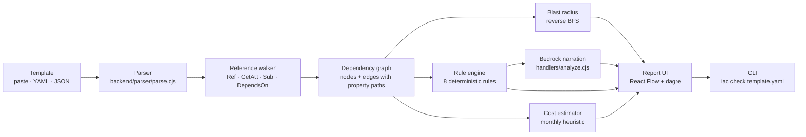

# IaC Visualizer

Know what breaks before you change it.


[Try it →](https://main.dm50udtc9sqd0.amplifyapp.com/)

IaC Visualizer parses a CloudFormation or SAM template into an interactive dependency graph and answers one question: if I change this resource, what transitively breaks? Click any node to see its blast radius — direct and indirect dependents, with the property path that creates each edge. Eight deterministic rules flag misconfigurations, including cross-resource cases that no other tool catches. Amazon Bedrock narrates the findings. A CLI wraps the same engine for CI.

## Deployment

A live instance runs on AWS: the frontend on Amplify Hosting, three Lambda functions behind one API Gateway HTTP API, and Amazon Bedrock for narration. The backend is provisioned with AWS SAM as a single CloudFormation stack. Total cost at demo scale is about $0.02/month.

## The problem

When you change or delete a CloudFormation resource, nothing tells you what else breaks. Change sets show one hop. cfn-lint checks each resource in isolation. Infrastructure Composer draws the graph but doesn't compute impact. Checkov flags misconfigurations resource by resource. Every one of them treats resources as individual objects.

That leaves two classes of bug that pass review:

- The invisible blast radius. A security group change that looks like a two-line diff, down through the app tier, into the database subnet. The diff shows what changed. It doesn't show what breaks.
- The relationship bug. A Lambda reads from an S3 bucket through its environment variables. Its execution role grants only `logs:` permissions — no `s3:` access at all. CloudFormation deploys this cleanly. The Lambda fails the first time it tries to read the bucket with `AccessDenied`. cfn-lint can't catch it because each of the three resources is individually valid. The bug only exists in the relationship between them.

## How it works



1. Parse — CloudFormation's `!Ref`, `!GetAtt`, and `!Sub` are not valid YAML. The parser registers every intrinsic tag with `js-yaml-cloudformation-schema` and walks each resource's properties, looking for four reference patterns.
2. Build the graph — every extracted reference is filtered against the actual resource list. Without that filter, `AWS::StackName`, parameter names, and condition names become phantom nodes.
3. Compute blast radius — reverse BFS from any clicked node. Edges carry the property path that produced them, so `PublicSubnetA — Properties.VpcId` explains why two resources are connected.
4. Run rules — eight deterministic checks. The cross-resource rule compares a Lambda's references against its execution role's IAM permissions.
5. Narrate — Bedrock Nova Micro explains the flags the rule engine already found. Same template in, same flags out, every run. The model is downstream of the analysis.
6. Report — a React UI with the diagram, blast radius panel, flag cards, cost breakdown, and a sandbox for hypothetical dependencies.

## Features

| Feature | What you get |
| --- | --- |
| Interactive diagram | Every resource as a node, every reference as an edge, color-coded by category |
| Blast radius | Click any resource — direct + indirect dependents with the property path for each edge |
| Eight deterministic rules | Open ports, public S3, IAM wildcards, public RDS, unencrypted volumes, over-permissive managed policies, and a cross-resource permission check |
| Sandbox mode | Drag a hypothetical dependency, blast radius recalculates live. Simulate deletes. Template unchanged |
| Cost estimate | Per-resource monthly heuristic. Labelled as a heuristic, not a bill |
| AI narration | Bedrock Nova Micro explains flags in plain English; falls back gracefully |
| CLI | `iac check template.yaml` — exit code 1 on high-severity findings, ready for pre-commit hooks and CI |
| Test suite | Fixture-driven, asserts exact counts. CI runs on every push |

## Quickstart

Frontend (React on `:5173`):

```bash
git clone https://github.com/aniruddha9674/iac-visualizer.git
cd iac-visualizer
npm install
npm run dev
```

Opens at `http://localhost:5173`. The frontend defaults to the deployed API. To point it at your own backend, create `.env.local`:

```
VITE_API_URL=https://<your-api-gateway-url>
```

CLI:

```bash
cd cli
npm link
cd ..

iac check hero-demo.yaml
iac check hero-demo.yaml --blast VPC
iac check hero-demo.yaml --json
```

Exit codes: `0` clean, `1` high-severity flag, `2` usage or parse error.

Tests:

```bash
node scripts/test.cjs    # parser, blast radius, rules, handler
node cli/test.cjs        # CLI
```

## Environment variables

| Variable | Where | Purpose |
| --- | --- | --- |
| `BEDROCK_REGION` | `infra/template.yaml` | Region for Bedrock (default `us-east-1`) |
| `BEDROCK_MODEL_ID` | `infra/template.yaml` | Bedrock model (default `amazon.nova-micro-v1:0`) |
| `VITE_API_URL` | Amplify console / `.env.local` | Backend base URL for the frontend |

## AWS in this project

- AWS Lambda — three functions, Node 22 on ARM64. `ParseFunction` runs the parser, reference walker, blast radius BFS, eight rules, and cost estimator. `AnalyzeFunction` and `AskFunction` call Bedrock for narration and Q&A.
- Amazon API Gateway (HTTP API) — three routes: `POST /parse`, `POST /analyze`, `POST /ask`.
- Amazon Bedrock — Nova Micro via the messages API. Nova rather than Claude because AISPL (AWS India) accounts hit a Marketplace subscription gate on Anthropic models. Nova is a first-party model, needs no subscription, and costs a fraction for a formatting task.
- AWS Amplify Hosting — the React frontend, CI-deployed from GitHub on every push.
- AWS SAM — the entire backend is one SAM template: three Lambdas, one HTTP API, and their IAM execution roles. `sam build && sam deploy` provisions everything as a single CloudFormation stack.
- AWS CloudFormation — the deployed stack is visible in the console with full resource list and events.
- AWS IAM — one execution role per Lambda, scoped to Bedrock invoke permissions.
- Amazon S3 / CloudWatch — SAM deployment bucket and Lambda logs.

## Demo targets

Two templates in the repo, chosen because they demonstrate different things:

| Template | What it shows |
| --- | --- |
| `hero-demo.yaml` | 27 resources. Clicking the VPC shows 17 affected (63%) — 10 direct, 7 indirect. Fires all eight rules including the `PERMISSION_NOT_GRANTED` cross-resource check on `JobProcessor` |
| `backend/parser/fixtures/s3-lambda.yaml` | The minimum case — three resources, three edges, one flag. Good for confirming the parser works before loading a larger template |

Any real CloudFormation template works too. Paste one you inherited and click a central resource.

## Limitations

- Static analysis only. The parser reads the template's text and reasons about references. It does not deploy, run, or diff against a live AWS account. See [docs/BACKEND.md](docs/BACKEND.md) for the full list of what it can't catch.
- SAM transform not expanded. `AWS::Serverless::Function` is shorthand. The parser sees one node; the deployed stack has four or more.
- Cross-stack references not followed. `Fn::ImportValue` into another template is treated as external. The graph is single-template.
- Managed policies checked by name, not content. `IAM_MANAGED_POLICY_OVERPERMISSIVE` matches policy names (`*FullAccess`, `AdministratorAccess`). It doesn't expand custom customer-managed policies.
- `PERMISSION_NOT_GRANTED` scoped to S3. The resource-to-IAM-prefix mapping currently covers `AWS::S3::Bucket`. DynamoDB, SQS, and SNS are one-line additions.
- Cost estimates are heuristic. Hardcoded table, low-traffic assumptions, labelled in the UI.
- Advisory by design. A clean scan is not a guarantee. The tool flags relationships; it doesn't deploy, apply changes, or replace review.

## Credits & license

Built solo for the AWS × WeMakeDevs First Commit hackathon (Sept 17–20, 2026). CloudFormation's intrinsic tag specification is at [docs.aws.amazon.com](https://docs.aws.amazon.com/AWSCloudFormation/latest/UserGuide/intrinsic-function-reference.html); the CloudFormation YAML schema for `js-yaml` is [js-yaml-cloudformation-schema](https://www.npmjs.com/package/js-yaml-cloudformation-schema). Demo templates in `samples/` and `hero-demo.yaml` are original.

Licensed under MIT — see [LICENSE](LICENSE).

## Prior art & what IaC Visualizer adds

Open-source and first-party tools exist for every part of this problem: Infrastructure Composer renders a template as a graph, cfn-diagram produces draw.io and Mermaid output from the CLI, cfn-lint validates each resource against the schema, Checkov and cfn-nag run security checks resource by resource, and CloudFormation Change Sets show one-hop deploy impact.

They all share one property: they treat resources as individual objects.

IaC Visualizer is built around the relationship between resources:

- Blast radius, computed not inferred. Reverse BFS over the dependency graph. Click any node, see every transitive dependent, direct and indirect, with the property path that created each edge. No other CloudFormation tool computes this — Composer draws the graph, cfn-diagram draws the graph, neither walks it.
- Cross-resource rules, not property checks. `PERMISSION_NOT_GRANTED` cross-references a Lambda, what it references, and what its IAM role grants. cfn-lint can't catch this because each resource is valid on its own. The bug only exists in the relationship between three of them.
- CLI, not just a browser tab. `iac check template.yaml` runs the same engine and returns exit code 1 on high-severity findings. That form factor drops into a pre-commit hook or a CI step without anyone remembering to open a browser.

In one line: diagram tools draw the graph, linters check each node — IaC Visualizer walks the graph and reports what depends on what.
